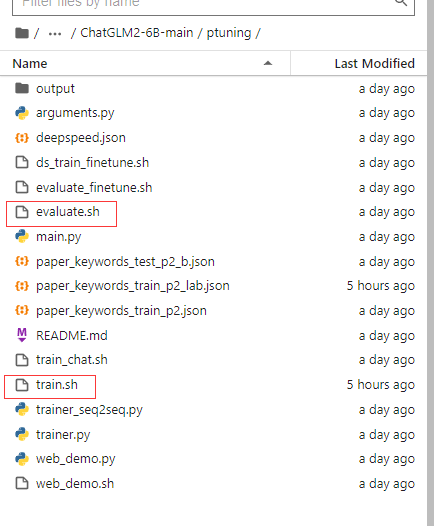
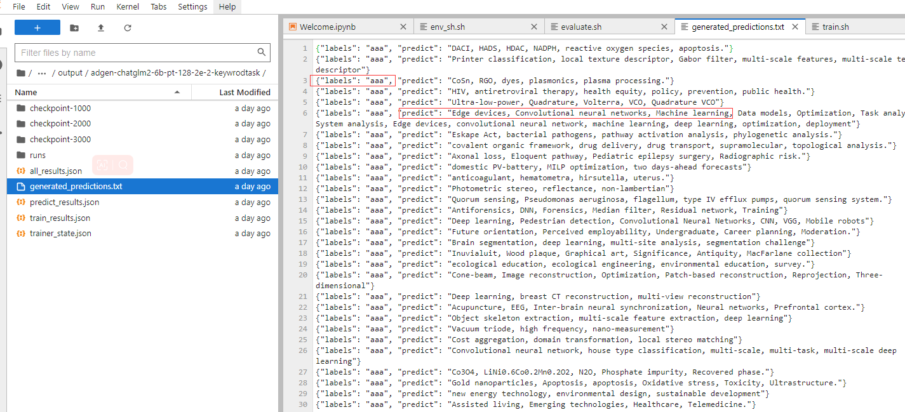
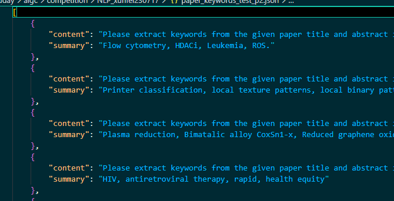

# GML系列Ptraing2 微调脚本使用方法



主要用到ChatGLM2-6B-main/ptuning/下的 train.sh 和 evaluate.sh文件

### train

在ptring文件夹下用如下命令启动

```sh
bash train.sh
```

脚本如下 和官方做了一些调整

```shell
PRE_SEQ_LEN=128
LR=2e-2
NUM_GPUS=1

# 这里 官方是 torchrun --standalone --nnodes=1 --nproc-per-node=$NUM_GPUS main.py \ 对gpu一些参数有设置   有的电脑可能会报错
# 改成了 CUDA_VISIBLE_DEVICES=0 python main.py \ 
CUDA_VISIBLE_DEVICES=0 python main.py \
    --do_train \
    # 训练文件
    --train_file paper_keywords_train_p2_lab.json \
    # 测试文件和训练保持一致就行
    --validation_file paper_keywords_train_p2_lab.json \
    --preprocessing_num_workers 10 \
    --prompt_column content \
    --response_column summary \
    --overwrite_cache \
    # 源模型的存储位置 就是HF下载的所有文件
    --model_name_or_path ../../../data-1/ \
    # 生成模型的存储
    --output_dir output/adgen-chatglm2-6b-pt-$PRE_SEQ_LEN-$LR \
    --overwrite_output_dir \ 
    --max_source_length 64 \
    --max_target_length 128 \
    # 批处理数量 增加会增加现存与训练时长 默认为1 
    --per_device_train_batch_size 4 \
    # 测试保持一致就行了  没发现有啥用……
    --per_device_eval_batch_size 4 \ 
    --gradient_accumulation_steps 16 \ 
    --predict_with_generate \
    --max_steps 3000 \ # 总训练步数
    --logging_steps 10 \ 
    --save_steps 1000 \ # 存储步数结点 这里是1000一存
    --learning_rate $LR \
    --pre_seq_len $PRE_SEQ_LEN \
    # --quantization_bit 4 压缩量化 看你gpu是否需要
```

训练完成就会有训练文件 

### test

evaluate.sh文件 用如下命令启动

```sh
bash train.sh
```

脚本如下 和官方做了一些调整

```sh
PRE_SEQ_LEN=128
CHECKPOINT=adgen-chatglm2-6b-pt-128-2e-2
STEP=3000
NUM_GPUS=1


# 这里 官方是 torchrun --standalone --nnodes=1 --nproc-per-node=$NUM_GPUS main.py \ 对gpu一些参数有设置   有的电脑可能会报错
# 改成了 CUDA_VISIBLE_DEVICES=0 python main.py \ 
CUDA_VISIBLE_DEVICES=0 python main.py \
    --do_predict \
    # 验证文件
    --validation_file paper_keywords_test_p2_b.json \
    # 测试文件 和上面保持一致即可
    --test_file paper_keywords_test_p2_b.json \
    --overwrite_cache \
    --prompt_column content \
    --response_column summary \
    # 源模型的存储位置 就是HF下载的所有文件
    --model_name_or_path ../../../data-1/ \
    --ptuning_checkpoint ./output/$CHECKPOINT/checkpoint-$STEP \
    # 输出文件  是一个txt
    --output_dir ./output/$CHECKPOINT \
    --overwrite_output_dir \
    --max_source_length 64 \
    --max_target_length 64 \
    # 选择更大的size可以加速训练
    --per_device_eval_batch_size 16 \
    --predict_with_generate \
    --pre_seq_len $PRE_SEQ_LEN \
     # --quantization_bit 4 压缩量化 看你gpu是否需要
```

验证文件输出介绍：

在output 下一个文件下里面  能翻到**generated_predictions.txt**

你的**labels**就是喂进去的数据  作参考用的，你可以直接看**predict** 是模型预测出来的结果



### data

聊一下数据构建

P2 数据构架结构如下：



单条数据样例，不论是测试还是训练都是这个模版，按照这个方式构建即可

```json
[
    {
        "content":"prompt & question",
        "summary":"answer"
    },
]
```

### 环境安装

可以新建一个sh 在ChatGLM文件下跑一下这个  环境蛮轻松的~

```sh
pip install -r requirements.txt -i https://pypi.tuna.tsinghua.edu.cn/simple
pip install rouge_chinese nltk jieba datasets -i https://pypi.tuna.tsinghua.edu.cn/simple
cd ptuning
```

